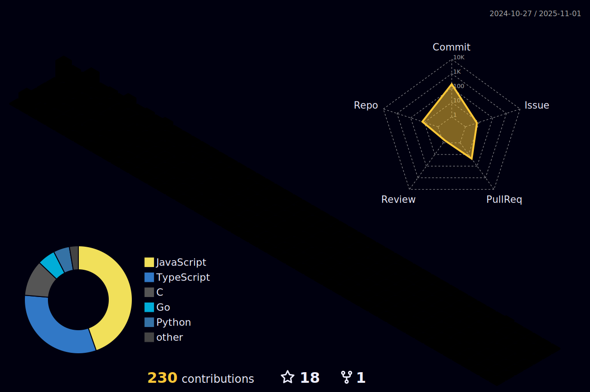

## Hey 👋, I'm Sandip Sapkota!

  

### Glad to see you here!

As a Bachelor's student in Computer Engineering and a budding full-stack developer with 8 months of experience, I have a strong passion for developing client-facing apps and websites, coupled with cutting-edge backend support.

My primary focus is on building robust backends that handle the heavy lifting for apps and websites. I enjoy designing systems that are lightweight yet powerful, distributed yet synchronized, and aesthetically pleasing yet highly effective. I also frequently blog about the intricate world behind the screen, discussing topics such as databases, security, servers, and optimization.

 

## Rapidfire

<table><tr><td valign="top" width="50%">

- 🔭 I’m currently working on [Nothing](https://www.sapkotasandip.com.np/)

- 🌱 I’m currently learning C++(OOP) and GoLang

- ❓ Ask me about anything related to MERN stack and related technologies

- ⚡ Fun fact: I keep night shift swithed on at all times

</td><td valign="top" width="50%">

</td></tr></table>

 

## Languages and Tools

  
  
  
  
  
  
  
  
  
  
  
  
  
  
  
  
  
  
  
  

   

 

## Github Stats

<table><tr><td valign="top" width="50%">

</td><td valign="top" width="50%">

</td></tr></table>

 

 

 
 
